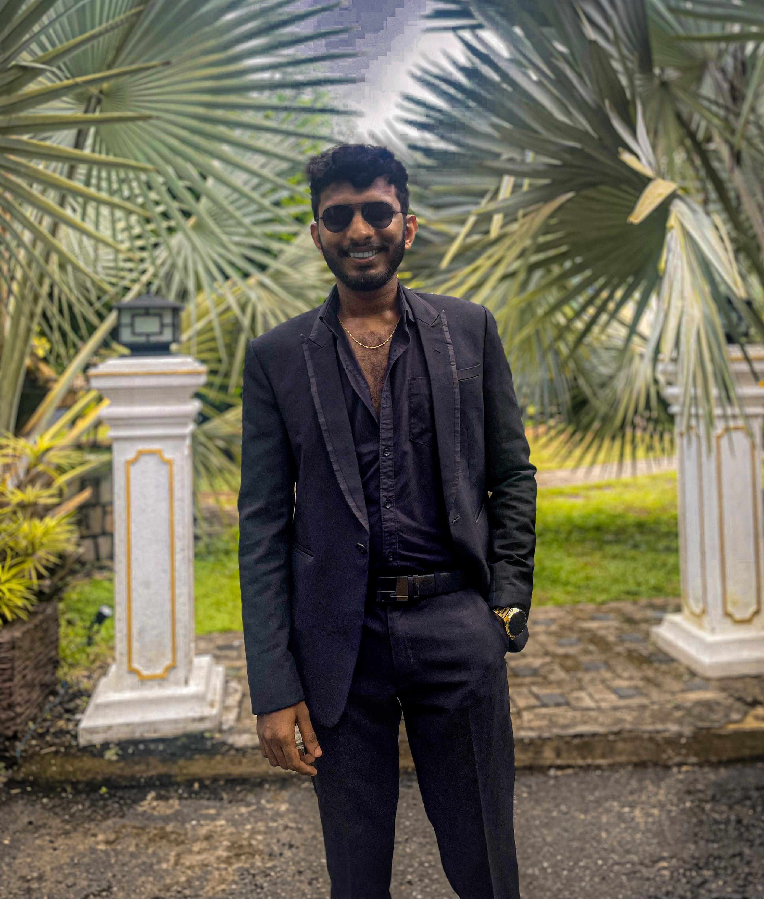

<!DOCTYPE html>
<html lang="en">

	
 
 
 
 
 
 <head>
    <meta charset="UTF-8">
    <meta name="viewport" content="width=device-width, initial-scale=1.0">
    <title>Kavindu Dhananjaya | ICT Portfolio</title>
    
</head>
<body>
    <!-- ============================================
         MAIN CONTAINER
         ============================================ -->
    

        
        <!-- ============================================
             HEADER SECTION - Name, Title, Contact
             ============================================ -->
        <header>
            <!-- Profile Image with popup functionality -->
		

    			
		

	    <!-- Image Modal/Popup -->
		

    			

        		&times;
        		
    			

		

            
            <!-- Main heading with name -->
            <h1>Kavindu Dhananjaya</h1>
            
            <!-- Job title/specialization with status -->
            

                
                ICT Undergraduate | Network Technology Specialist
            

            
            <!-- University information -->
            
University of Sri Jayewardenepura

            
            <!-- Professional badges -->
            

                Available for Internships
                Network Specialist
                IoT Developer
            

            
            <!-- Download CV button -->
            <a href="C:\Users\Kavindu Bosa\Desktop\Portfolio\CV/Kavindu Dhananjaya.pdf" class="download-cv" download="Kavindu Dhananjaya.pdf" target="_blank">
                📄 Download CV
            </a>
            
            <!-- Contact information buttons -->
            

                <a href="tel:+94728250339" class="contact-item">📞 +94 72 825 0339</a>
                <a href="mailto:dhananjayakd1@gmail.com" class="contact-item">📧 Email Me</a>
                <a href="https://linkedin.com/in/kavindu-dhananjaya" class="contact-item" target="_blank">💼 LinkedIn</a>
                <a href="https://github.com/kavindudhananjaya" class="contact-item" target="_blank">💻 GitHub</a>
            

        </header>

        <!-- ============================================
             ABOUT/PROFILE SECTION
             ============================================ -->
        <section class="section">
            <h2>Profile</h2>
            

                Dedicated ICT undergraduate specializing in networking, with a strong foundation in network protocols, 
                security, and system administration. Passionate about creating innovative solutions that bridge the gap 
                between technology and real-world applications. Seeking opportunities to apply and expand my networking 
                expertise in a professional environment while contributing to cutting-edge projects.
            

        </section>

        <!-- ============================================
             SKILLS SECTION - Hard & Soft Skills
             ============================================ -->
        <section class="section">
            <h2>Skills & Expertise</h2>
            

                
                <!-- Technical/Hard Skills Column -->
                

                    <h3>Technical Skills</h3>
                    

                        

                            
🌐

                            <h4>Network Configuration</h4>
                            
Router & Switch Setup

                        

                        

                            
🔧

                            <h4>Network Design</h4>
                            
Planning & Implementation

                        

                        

                            
💻

                            <h4>Object Oriented Programming</h4>
                            
Software Development

                        

                        

                            
🏠

                            <h4>IoT & Smart Systems</h4>
                            
Home Automation

                        

                    

                

                <!-- Soft Skills Column -->
                

                    <h3>Professional Skills</h3>
                    

                        

                            
⏰

                            <h4>Time Management</h4>
                            
Efficient Task Planning

                        

                        

                            
👥

                            <h4>Leadership</h4>
                            
Team Coordination

                        

                        

                            
🧩

                            <h4>Problem Solving</h4>
                            
Analytical Thinking

                        

                        

                            
🎯

                            <h4>Critical Thinking</h4>
                            
Strategic Analysis

                        

                    

                

            

        </section>

        <!-- ============================================
             PROJECTS SECTION
             ============================================ -->
        <section class="section">
            <h2>Featured Projects</h2>
            

                
                <!-- Project 1: Traffic Sign Recognition -->
                

                    <h3>🚦 Traffic Sign Recognition System</h3>
                    

                        Developed an Arduino-based Traffic Sign Recognition System with advanced computer vision capabilities. 
                        The system uses machine learning to recognize traffic signs, adjust vehicle speed automatically, 
                        and provide voice instructions to drivers for enhanced road safety.
                    

                    

                        Arduino
                        OpenCV
                        TensorFlow
                        CNN
                        Google Speech API
                    

                

                <!-- Project 2: Reservation System -->
                

                    <h3>📅 Lecture Halls & Labs Reservation System</h3>
                    

                        Created an automated reservation platform that streamlines facility booking for educational institutions. 
                        Lecturers can reserve facilities while students can view availability in real-time. Features include 
                        conflict detection, automated notifications, and comprehensive reporting.
                    

                    

                        React
                        MongoDB
                        Express.js
                        Node.js
                    

                

                <!-- Project 3: Smart Home Automation -->
                

                    <h3>🏠 Smart Home Automation System</h3>
                    

                        Designed and implemented a comprehensive smart home automation system using Cisco Packet Tracer. 
                        The project demonstrates practical networking and IoT integration skills with secure automation, 
                        real-time monitoring, and automated response systems for modern smart homes.
                    

                    

                        Cisco Packet Tracer
                        IoT
                        Network Security
                        Automation
                    

                

            

        </section>

        <!-- ============================================
             EDUCATION SECTION
             ============================================ -->
        <section class="section">
            <h2>Education</h2>
            
            <!-- Current University Education -->
            

                
2022 - Present

                <h3>Bachelor of Information and Communication Technology (Hons)</h3>
                
<strong>University of Sri Jayewardenepura</strong>

                
Specialized in Network Technology

                
Focus areas: Network protocols, security, system administration, and IoT integration

            

            <!-- Previous School Education -->
            

                
2017 - 2020

                <h3>Advanced Level Education</h3>
                
<strong>Bandaranayake College, Gampaha</strong>

                
Passed with B3 grades in ICT, Engineering Technology, and Science for Technology

            

        </section>

        <!-- ============================================
             FOOTER SECTION
             ============================================ -->
        <footer>
            
&copy; 2024 Kavindu Dhananjaya. Built with passion for technology and innovation 

            
Specialized in Network Technology | University of Sri Jayewardenepura

            
Version: 2.0.0 | Last Updated: June 2024

        </footer>
    

    <!-- ============================================
         JAVASCRIPT - Interactive Features
         ============================================ -->
    
</body>
</html>
